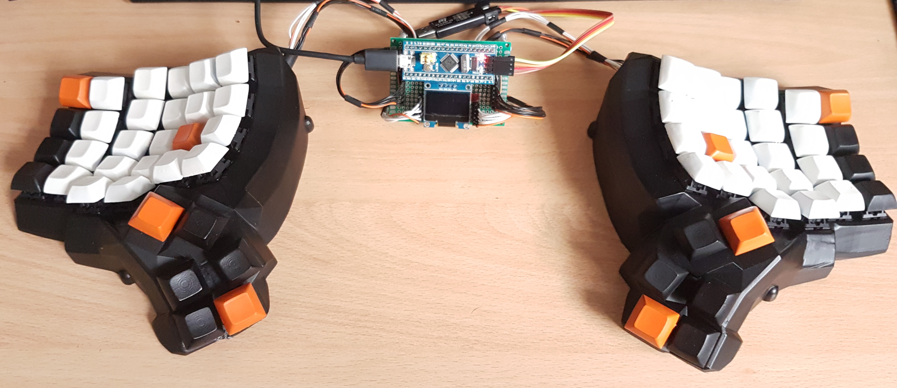
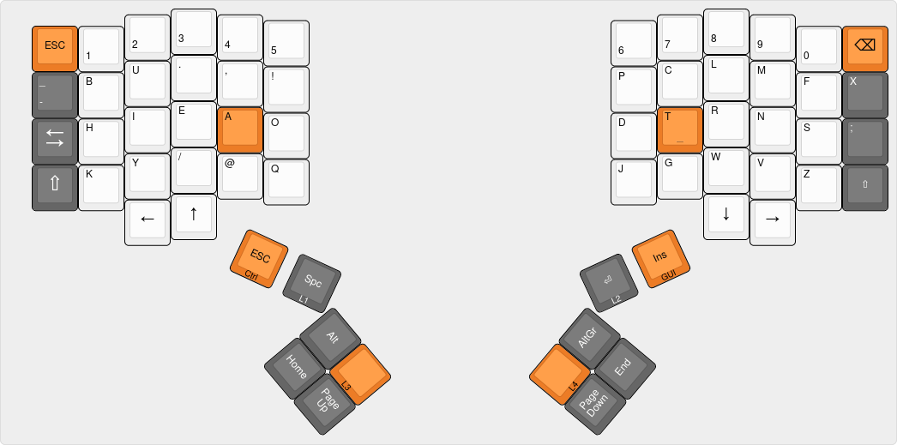

# Ferro Dactyl


> A BluePill (STM32F103) based [Dactyl-Manuform] build with [keyberon] powered
> firmware written in Rust. 



[Dactyl-Manuform]: https://github.com/20lives/Dactyl-Manuform
[keyberon]: https://github.com/TeXitoi/keyberon

## Layout

I'm using a [AdNW] based Layout. This is a work in progress.



You can take the layout definition from the [layout folder] and play with it
over at [Keyboard Layout Editor]. Or use [this link].

[AdNW]: http://www.adnw.de/
[layout folder]:layout/
[Keyboard Layout Editor]: http://www.keyboard-layout-editor.com/
[this link]: http://www.keyboard-layout-editor.com/#/gists/5a7d56aa6b7ebb05c0e3928ac5250a80

## Hardware

The [STLs] are generated using [20lives Dactyl-Manuform fork]. I'm using a 5x6
version.

[STLs]: stl/
[20lives Dactyl-Manuform fork]:  https://github.com/20lives/Dactyl-Manuform

## Firmware

The firmware uses the [keyberon] library.


```shell
curl https://sh.rustup.rs -sSf | sh
rustup target add thumbv7m-none-eabi
sudo apt-get install gdb-arm-none-eabi openocd
git clone https://github.com/wose/ferro-dactyl.git
cd ferro-dactyl
# connect ST-Link v2 to the blue pill and the computer
# openocd in another terminal
cargo run --release
```
See `keyberons` [building instructions] for more info.

[building instructions]: https://github.com/TeXitoi/keyberon/blob/master/BUILDING.md

## License

Licensed under either of

- Apache License, Version 2.0 ([LICENSE-APACHE](LICENSE-APACHE) or
  http://www.apache.org/licenses/LICENSE-2.0)
- MIT license ([LICENSE-MIT](LICENSE-MIT) or http://opensource.org/licenses/MIT)

at your option.

### Contribution

Unless you explicitly state otherwise, any contribution intentionally submitted
for inclusion in the work by you, as defined in the Apache-2.0 license, shall be
dual licensed as above, without any additional terms or conditions.
